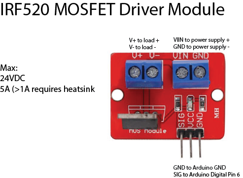

# Hardware

## Lights PWM Driver

IRF520 MOSFET Driver Module

Max:
24VDC
5A (>1A requires heatsink)

### Purchase Link

* 10VDC Power supply w/ barrel jack breakout https://www.amazon.com/gp/product/B09HT1BB2C/ref=ox_sc_act_title_1?smid=A362H7KPT65UPW&psc=1
* Mosfet driver board:
https://www.amazon.com/dp/B09TFFNH32/ref=sspa_dk_detail_1?psc=1&pd_rd_i=B09TFFNH32&pd_rd_w=ocnTa&content-id=amzn1.sym.88097cb9-5064-44ef-891b-abfacbc1c44b&pf_rd_p=88097cb9-5064-44ef-891b-abfacbc1c44b&pf_rd_r=XM3M1C6X034Q59JXM4Q6&pd_rd_wg=X7t0r&pd_rd_r=511a7d53-66fc-4dcc-8f4d-0795bf88b8ed&s=hi&sp_csd=d2lkZ2V0TmFtZT1zcF9kZXRhaWw

## Pump motor driver

7-24VDC
10A

### Purchase Link

* https://www.amazon.com/Cytron-Bi-directional-Driver-Shield-Arduino/dp/B01M3WQWRK/ref=sr_1_3?crid=O54VNAVSYJ0X&keywords=10Amp+7V-30V+DC+Motor+Driver+Shield+for+Arduino&qid=1669129902&s=industrial&sprefix=10amp+7v-30v+dc+motor+driver+shield+for+arduino%2Cindustrial%2C74&sr=1-3